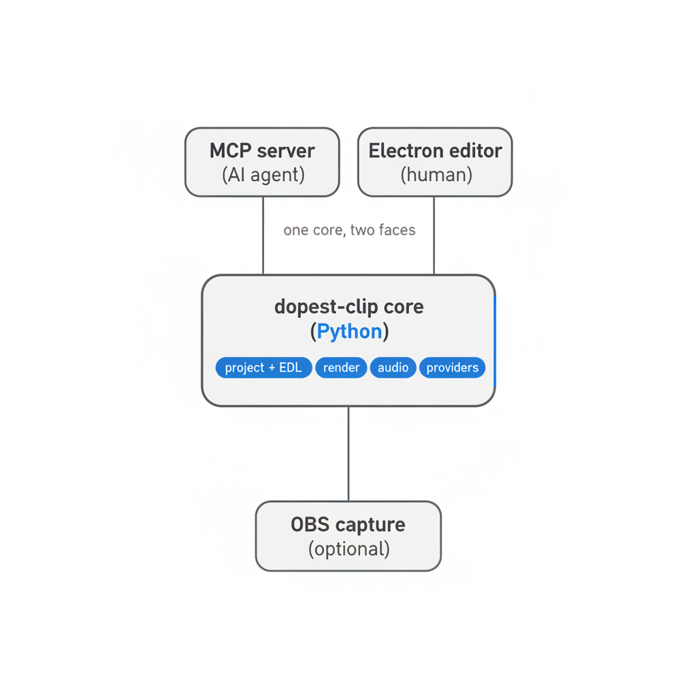
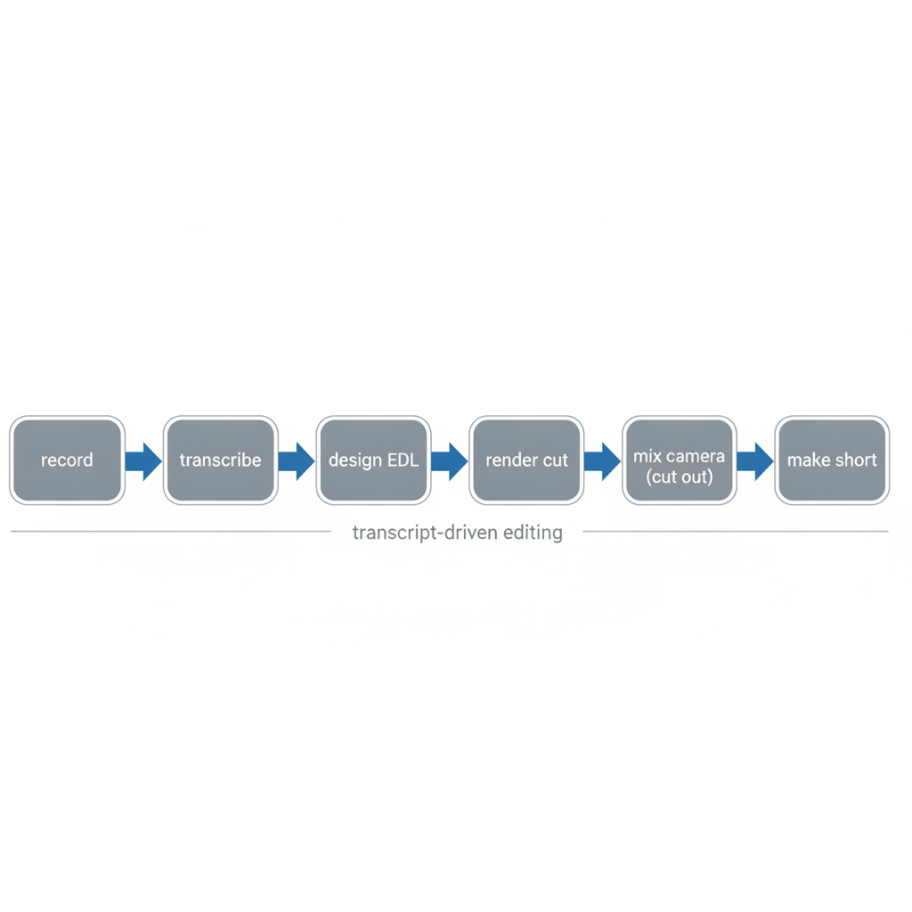
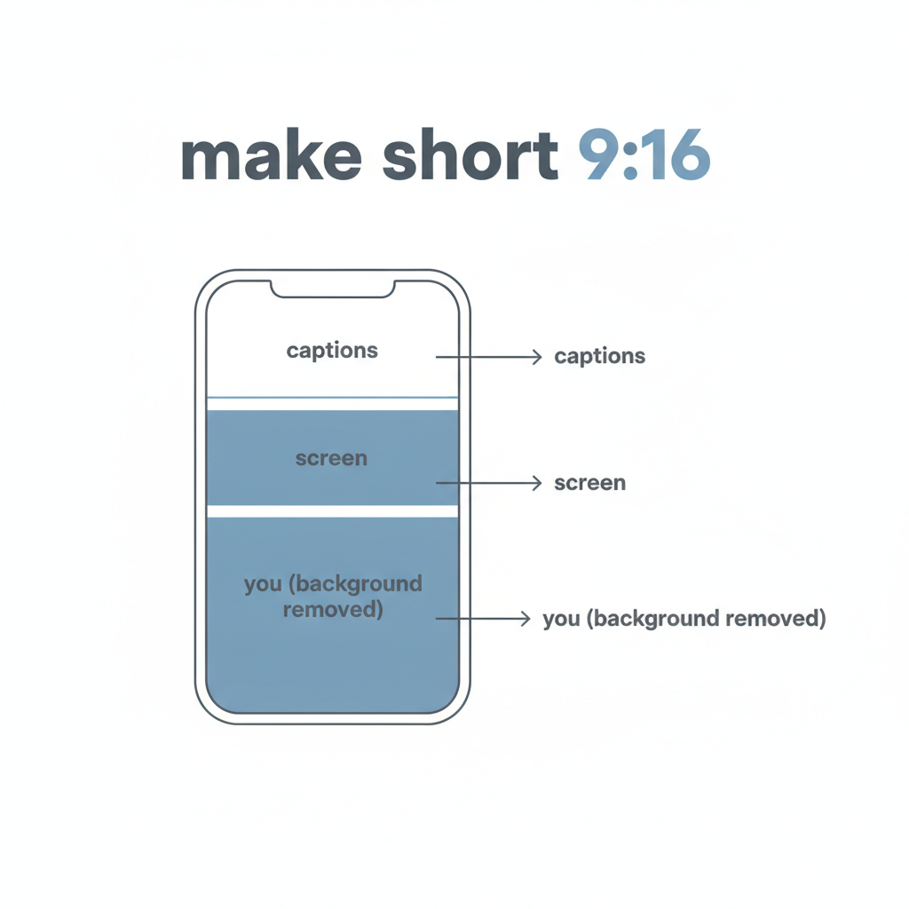

# dopest-clip

A local-first media studio that an AI agent or a person can drive. It records with OBS, cuts video by editing the transcript, processes audio, and generates images. It is OpusClip shaped but it runs on your machine, it is open source, and it is not tied to any one cloud vendor.

There are two ways to use it. An MCP agent calls the tools directly. A person opens the Electron editor. Both go through the same Python core and edit the same project files, so you get the same result either way.



## What it does

- Record a screen and a webcam to two separate files with OBS (the camera is recorded isolated so you can composite it later).
- Transcribe the audio with word-level timestamps and a silence map.
- Cut by transcript. You design an edit as a list of word ranges (an EDL). Cuts snap to silence so joins do not clip words.
- Reframe landscape to vertical with subject tracking, burn word-timed captions, and normalize loudness.
- Mix the webcam back over the cut with the background removed and the position animated.
- Build a 9:16 short with the person featured.
- Run local ffmpeg audio steps (normalize, denoise, trim silence, gain, fade, mix, convert), plus cloud TTS, ASR, sound effects, and audio QA through a provider you choose.
- Generate, edit, compose, and analyze images through a provider you choose, plus local Pillow ops.

## The editing loop



The core loop is:

```
create_project(video) -> transcribe(project) -> read the transcript.txt file ->
design an EDL -> validate_edl (cheap, no render) -> render -> verify_clip
```

The agent does the reading and the editing decisions. The tools are the accurate primitives: speech to text, a text-space validation pass that snaps to silence and reports any hard cuts, the renderer, the portrait reframe, captions, and an STT-based check that re-transcribes the render and diffs it against what you intended.

An EDL is just the edit as data:

```json
{
  "edl_id": "hook-v1",
  "segments": [
    {"from_word": 880, "to_word": 905, "label": "hook"},
    {"from_word": 0,   "to_word": 120, "label": "setup"}
  ],
  "cleanup": {"remove_fillers": true, "max_pause": 1.0},
  "reframe": {"mode": "track", "aspect": "9:16"},
  "captions": {"enabled": true, "preset": "karaoke-bold"},
  "loudnorm": true
}
```

Word indices are stable. Segments can be reordered and reused, so opening on the hook and cutting back to the setup is a first-class move, not a hack.

## The featured short

`make_short` builds the vertical layout people expect from short-form: captions on top, the screen in the middle, and you at the bottom with your background removed. You design the short against the cut transcript (`get_cut_transcript` gives you the word indices on the cut timeline).



The order is: `render` the cut, `mix_camera(..., remove_background=True)` to build the matte once, then `make_short(edl_id, from_word, to_word, hook_title)`. The matte is cached per cut, so making several shorts from the same take only pays for it once.

## Clip art and overlays

`compose_camera` puts the camera over the full screen recording with an animated position, and it can lay graphics on top. You can pass a built-in shape (arrow, ring, box, label from `list_graphics`), an inline SVG, or a transparent PNG. Time an overlay to a spoken word by reading that word's start and end from the transcript, then set the overlay to pop a moment before it. A lightbulb over your head when you say "I have an idea" is a few lines of overlay config.

## Install

You need `ffmpeg` and `ffprobe` on your PATH. Everything else is optional and grouped into extras so a plain editing install stays small.

```bash
pip install -e .            # editing core only (ffmpeg-driven, no ML)
pip install -e ".[stt]"     # whisperx + torch + openai (speech to text)
pip install -e ".[matting]" # rembg + torch + moviepy (camera background removal)
pip install -e ".[reframe]" # ultralytics + opencv (subject-tracked portrait)
pip install -e ".[graphics]"# resvg (SVG overlays)
pip install -e ".[obs]"     # websocket-client (OBS recording control)
pip install -e ".[all]"     # a full local workstation install
```

GPU note: the camera matte and the whisperx model want CUDA. A `+cpu` torch wheel still works but it falls back to slow CPU matting. Install the CUDA torch wheel that matches your driver from `download.pytorch.org/whl`. On a recent NVIDIA card the matte runs close to the speed of the clip, so matte a short first and leave a long take for when you have a minute.

## Run it as an MCP server

`python -m dopest_clip` is the agent face. Point your MCP client at the venv python:

```json
{
  "mcpServers": {
    "dopest-clip": {
      "command": "/path/to/.venv/bin/python",
      "args": ["-m", "dopest_clip"],
      "env": {
        "DOPEST_PROJECTS_ROOT": "/path/to/projects",
        "STT_BACKEND": "openai",
        "OPENAI_API_KEY": "sk-...",
        "OBS_WS_HOST": "localhost",
        "OBS_WS_PORT": "4455",
        "OBS_WS_PASSWORD": "your-obs-ws-password"
      }
    }
  }
}
```

Read the `learn://` resources before driving it. Start with `learn://overview`, then the one for the part you need (`learn://recording`, `learn://editing`, `learn://cutting`, `learn://reframe`, `learn://captions`, `learn://audio`, `learn://image`, `learn://providers`, `learn://gotchas`). They carry the operational details, including the GPU matte speed and the OBS recording gotchas.

## Run it as an editor

The Electron app in `desktop/` runs the same core as a localhost sidecar (`python -m dopest_clip --serve`) and edits the same project files. The renderer never talks to the network itself; the main process proxies the sidecar.

```bash
cd desktop
npm install
npm run build
DOPEST_PYTHON=/path/to/.venv/bin/python npm start
```

Set `DOPEST_PYTHON` to the venv python that has the package installed, otherwise the sidecar cannot import it. The editor shows the transcript, the EDL timeline, an inspector, and a video player for the rendered output, and it can run the camera mix and make a short.

## Providers

Every cloud capability (LLM, STT, TTS, sound effects, audio QA, image) goes through a registry. You pick the active provider per capability and you bring your own key. FlowDot is one option. So are OpenAI, OpenRouter, Fish, ElevenLabs, and Gemini. Nothing is locked to one vendor, and a missing key fails loudly at use time instead of quietly swapping to something else.

```
list_providers()                      # what is available and what is configured
set_provider("image", "gemini")       # choose the active provider for a capability
validate_provider("stt")              # check configuration
```

Keys are read from the environment: `OPENAI_API_KEY`, `GEMINI_API_KEY`, `ELEVENLABS_API_KEY`, `FISH_AUDIO_API_KEY`, `OPENROUTER_API_KEY`, and the `FLOWDOT_*` set. Copy `providers.example.toml` to `providers.toml` for overrides (that file is git-ignored because it holds your keys).

## Where files go

Projects live under `DOPEST_PROJECTS_ROOT` (or `./projects`). Each project holds its source metadata, extracted audio, the transcript, the EDLs, the renders, grabbed frames, and the cached camera matte. OBS writes the isolated camera files under `recordings/`. Both directories are git-ignored because they are regenerated, not source.

## Tests

```bash
pytest                  # Python core
cd desktop && npm test  # renderer + sidecar client
```

The Python suite covers the pure logic (EDL resolution, silence math, the validation loop, provider selection, the matte backend routing) and stays out of the GPU and network paths, which are marked and skipped unless the hardware and keys are present.

## Scope

This is a v1. The camera mix and the short layout are solid. The editor is a working editing surface with a video player, not a full timeline NLE yet. Overlays run through `compose_camera`, not yet through `make_short`. A graphical keyframe editor is on the list. The pieces that are not built raise a clear error rather than pretending to work.

## License

Apache-2.0.
